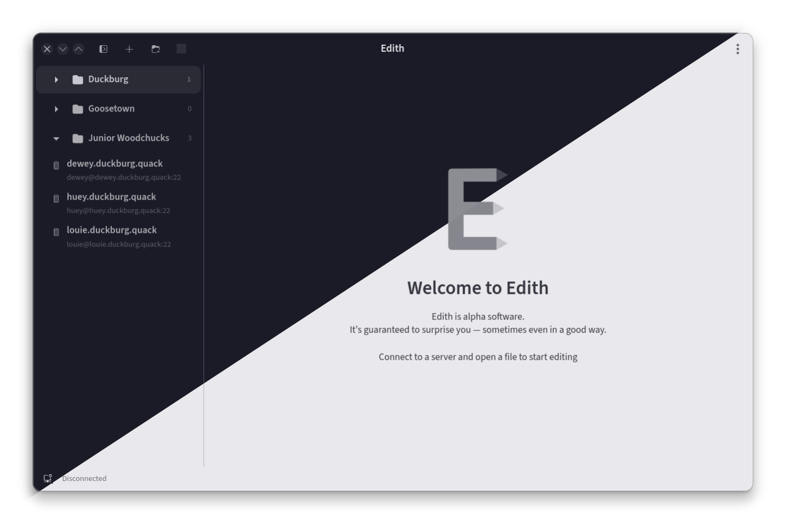
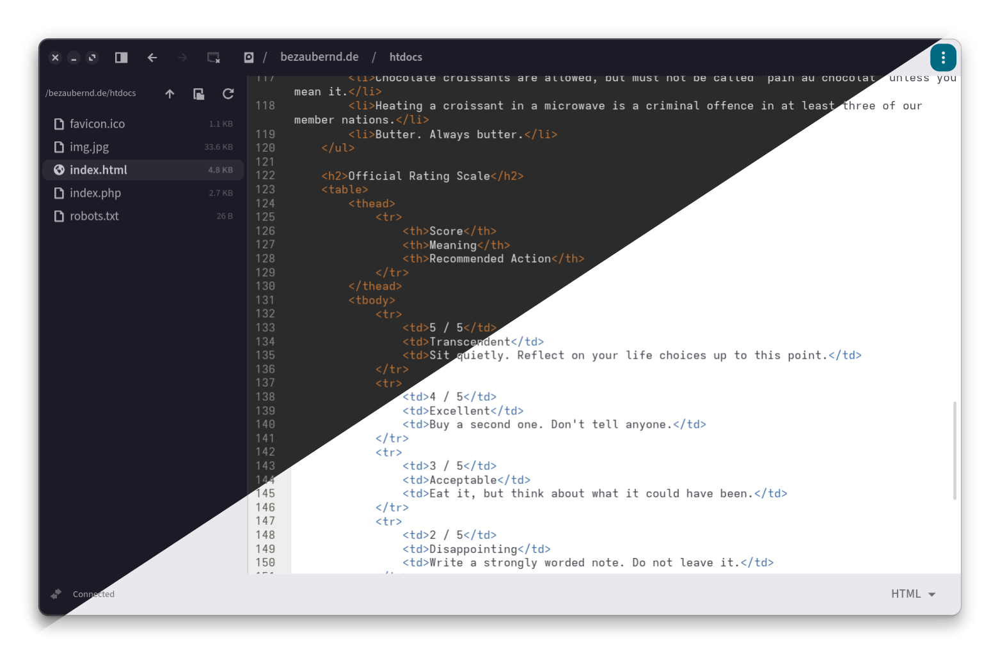

# Edith

A GTK4/libadwaita SFTP client for live remote file editing.
(a poor man's Nova ©)

Connect to remote servers over SSH, browse files, and edit them in a tabbed editor with syntax highlighting — changes are uploaded back on save.

> **Alpha software.** Early access for the brave and the bug‑tolerant.

## Features

- **Server management** — saved connections with password/key auth, organized into collapsible folder groups; change passwords after initial setup
- **Server search** — Ctrl+F to filter servers by name
- **File browser** — navigate remote directories with drag-and-drop move, upload, copy, rename, delete; keyboard shortcuts for common actions
- **Path bar** — clickable breadcrumb navigation in the title bar with back/forward history
- **Tabbed editor** — GtkSourceView 5 with syntax highlighting, customizable themes and fonts
- **Syntax selector** — per-file language override in the status bar
- **Custom syntax associations** — map file extensions to languages (e.g. `.tpl` → PHP)
- **Secure credentials** — passwords and key passphrases are stored in the system keychain via libsecret (GNOME Keyring or any compatible provider). They are never written to disk in plain text. Server hostnames, usernames and other non-sensitive settings are stored in `~/.config/edith/servers.json`.
- **Live editing** — files downloaded to temp, edited locally, uploaded on save
- **Home directory support** — use `~` as initial directory to resolve the server's home path
- **Resizable sidebar** — drag to adjust width

## Keyboard shortcuts

| Key | Action |
|-----|--------|
| Ctrl+N | Add server |
| Ctrl+F | Search servers |
| Ctrl+D | Disconnect |
| Ctrl+S | Save file |
| Ctrl+W | Close tab |
| Ctrl+Q | Quit |
| F9 | Toggle sidebar |
| F2 | Rename selected file |
| Delete | Delete selected file |
| F5 | Refresh directory |
| Backspace | Go up one directory |

## Dependencies

- Python 3
- GTK 4
- libadwaita
- GtkSourceView 5
- python-paramiko
- python-gobject
- python-keyring

## Building (Arch Linux)

```sh
makepkg -sc
sudo pacman -U edith-*.pkg.tar.zst
```

If pacman reports conflicting files (e.g. after a manual install), use:

```sh
sudo pacman -U --overwrite '/usr/share/edith/*' edith-*.pkg.tar.zst
```

## Building (manual)

```sh
meson setup builddir --prefix=/usr
ninja -C builddir
sudo meson install -C builddir
```

## Usage

```sh
edith
```

Or launch from your application menu.

## License

GPL-3.0-or-later

## Screenshots





## Disclaimer

This project was created with AI assistance. The code has not been thoroughly reviewed. Verify its correctness and suitability before use. 
