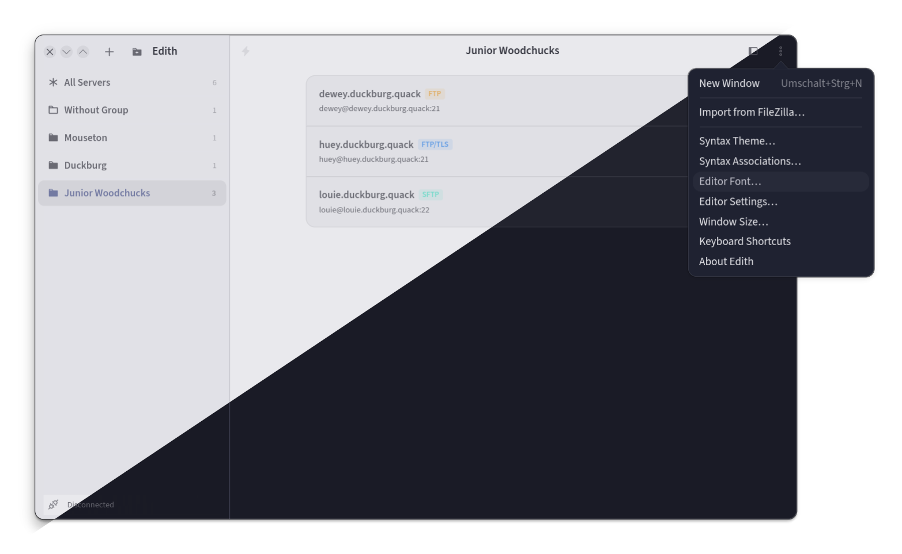
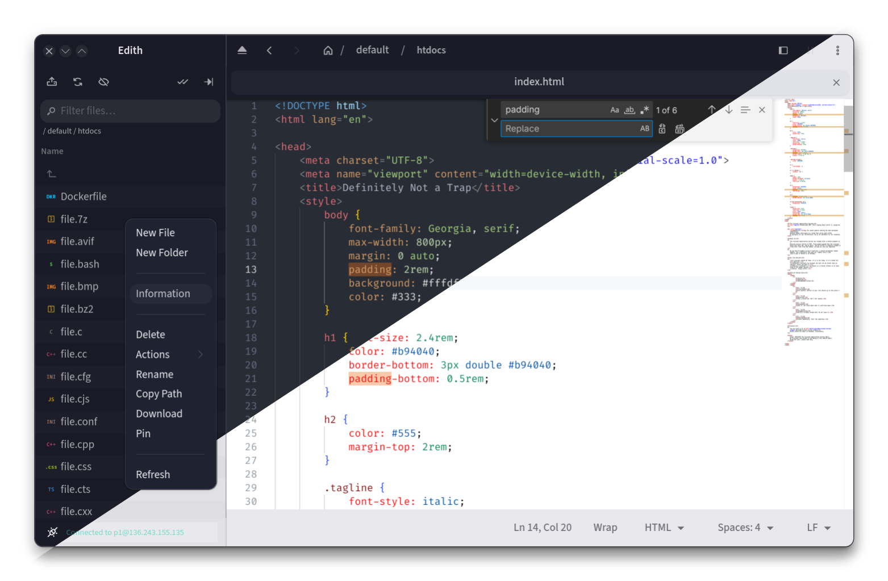

# Edith

A GTK4/libadwaita SFTP/FTP client for live remote file editing.
(a poor man's Nova ©)

Connect to remote servers over SFTP or FTP, browse files, and edit them in a tabbed editor with syntax highlighting — changes are uploaded back on save.

> **Alpha software.** Early access for the brave and the bug‑tolerant.


## Features

- **SFTP & FTP** — SFTP (SSH), plain FTP, FTPS with explicit or implicit TLS
- **Server management** — saved connections with password/key auth, organized into drag-and-drop groups
- **File browser** — sortable columns, drag-and-drop move/upload/copy, multi-select, pinned files, archive creation (SFTP), breadcrumb path bar with history
- **Monaco editor** — VS Code's engine via WebKitGTK — syntax highlighting for 80+ languages, Emmet, find/replace, go to line, word wrap, customizable themes and fonts
- **Live editing** — files downloaded to temp, edited locally, uploaded on save; detects external changes on the server and reloads automatically
- **Image & SVG** — raster images open in a viewer with metadata; SVGs get a live side-by-side preview
- **Secure credentials** — system keychain (GNOME Keyring or compatible), never plain text on disk

## Keyboard shortcuts

| Key | Action |
|-----|--------|
| Ctrl+N | Add server |
| Ctrl+Shift+N | New window |
| Ctrl+D | Disconnect |
| Ctrl+S | Save file |
| Ctrl+W | Close tab |
| Ctrl+Shift+T | Reopen closed tab |
| Ctrl+F | Find (editor) / Search servers |
| Ctrl+Shift+F | Find and replace |
| Ctrl+G | Go to line |
| Ctrl+Shift+W | Toggle word wrap |
| Ctrl+/ | Toggle line comment |
| Ctrl+Z / Ctrl+Shift+Z | Undo / Redo |
| Ctrl+Q | Quit |
| F9 | Toggle sidebar |
| F2 | Rename file |
| F5 | Refresh directory |
| Delete | Delete selected file(s) |
| Backspace | Parent directory |

## Dependencies

- Python 3
- GTK 4
- libadwaita
- WebKitGTK 6.0
- python-paramiko
- python-gobject
- python-keyring

## Building (Arch Linux)

```sh
makepkg -sc
sudo pacman -U edith-*.pkg.tar.zst
```

If pacman reports conflicting files (e.g. after a manual install), use:

```sh
sudo pacman -U --overwrite '/usr/share/edith/*' edith-*.pkg.tar.zst
```

## Building (manual)

```sh
meson setup builddir --prefix=/usr
ninja -C builddir
sudo meson install -C builddir
```

## Usage

```sh
edith
```

Or launch from your application menu.

## License

MIT

## Credits

Edith uses [Phosphor Icons](https://phosphoricons.com/) (MIT)

## Screenshots





## Disclaimer

This project was developed with AI assistance. The code has been analysed with Codacy and Bandit. Use at your own discretion.  
[](https://app.codacy.com/gh/mkay/edith/dashboard)
