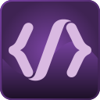
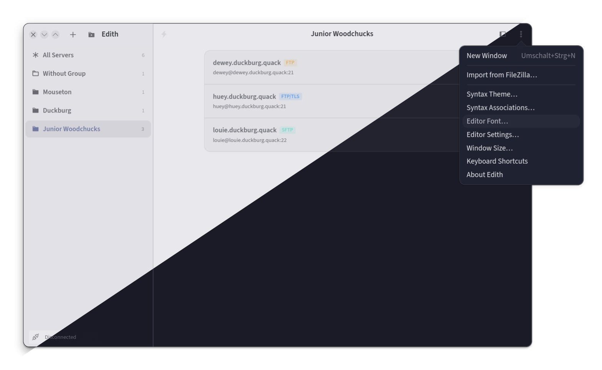
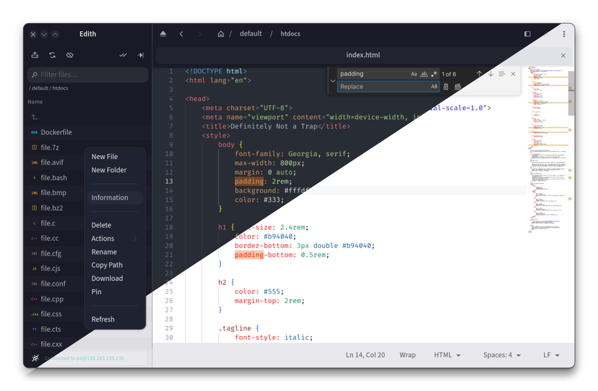

# Edith

A GTK4/libadwaita SFTP/FTP client for live remote file editing.
(a poor man's Nova ©)

Connect to remote servers over SFTP or FTP, browse files, and edit them in a tabbed editor with syntax highlighting — changes are uploaded back on save.

> **Alpha software.** Early access for the brave and the bug‑tolerant.



## Features

- **SFTP & FTP** — SFTP (SSH), plain FTP, FTPS with explicit or implicit TLS
- **Server management** — saved connections with password/key auth, organized into drag-and-drop groups
- **File browser** — sortable columns, drag-and-drop move/upload/copy, drag files out to download them, shift/ctrl+click multi-select, pinned files, breadcrumb path bar with history, parent directory dropdown for quick navigation
- **Upload tools** — keep frequently used scripts (e.g. adminer.php) in a tools folder; upload them to any directory via the right-click menu
- **Monaco editor** — VS Code's engine via WebKitGTK — syntax highlighting for 80+ languages, Emmet, find/replace, go to line, word wrap, customizable themes and fonts
- **Live editing** — files downloaded to temp, edited locally, uploaded on save; detects external changes on the server and reloads automatically
- **Your own editor too** — open or edit any remote file in a local application, with per-file-type associations you choose
- **Image & SVG** — raster images open in a viewer with metadata; SVGs get a live side-by-side preview
- **Languages** — English and German so far, selectable in Preferences or following your system. [More are welcome](#translations)
- **Preferences** — one window for editor, file and general settings, including single- or double-click navigation
- **Secure credentials** — system keychain (GNOME Keyring or compatible), never plain text on disk
- **Safe by default** — your servers and settings are backed up automatically at every start

## Keyboard shortcuts

| Key | Action |
|-----|--------|
| Ctrl+N | Add server |
| Ctrl+Shift+N | New window |
| Ctrl+D | Disconnect |
| Ctrl+S | Save file |
| Ctrl+W | Close tab |
| Ctrl+Shift+T | Reopen closed tab |
| Ctrl+F | Find (editor) / Search servers |
| Ctrl+Shift+F | Find and replace |
| Ctrl+G | Go to line |
| Ctrl+Shift+W | Toggle word wrap |
| Ctrl+/ | Toggle line comment |
| Ctrl+Z / Ctrl+Shift+Z | Undo / Redo |
| Ctrl+Q | Quit |
| F9 | Toggle sidebar |
| F2 | Rename file |
| F5 | Refresh directory |
| Delete | Delete selected file(s) |
| Backspace | Parent directory |

## Install

### Flatpak

Edith is not on Flathub — their policy doesn't allow AI-assisted apps, and Edith
is — so it has [its own Flatpak repository](https://mkay.github.io/edith-flatpak/):

```sh
flatpak remote-add --user edith https://mkay.github.io/edith-flatpak/edith.flatpakrepo
flatpak install edith de.singular.edith
```

Updates then arrive with `flatpak update`. The GNOME runtime comes from Flathub,
so that remote has to exist too:

```sh
flatpak remote-add --if-not-exists --user flathub https://dl.flathub.org/repo/flathub.flatpakrepo
```

### Arch and Debian packages

Prebuilt `.pkg.tar.zst` and `.deb` artefacts are attached to each
[release](https://github.com/mkay/edith/releases).

## Dependencies

- Python 3
- GTK 4
- libadwaita
- WebKitGTK 6.0
- python-paramiko
- python-gobject
- python-keyring
- python-defusedxml
- python-cryptography

## Building (Arch Linux)

```sh
makepkg -sc
sudo pacman -U edith-*.pkg.tar.zst
```

If pacman reports conflicting files (e.g. after a manual install), use:

```sh
sudo pacman -U --overwrite '/usr/share/edith/*' edith-*.pkg.tar.zst
```

## Building (manual)

```sh
meson setup builddir --prefix=/usr
ninja -C builddir
sudo meson install -C builddir
```

## Usage

```sh
edith
```

Or launch from your application menu.

## Translations

Edith currently speaks English and German. Pick a language under
**Preferences → General**, or leave it following your system.

**Would you like Edith in your own language?** Translating it means editing one
text file — no build environment, no code. Everything you need is in
[TRANSLATING.md](TRANSLATING.md).

One request: please translate only into your **mother tongue**, or a language
you genuinely speak. Running the strings through a machine translator is easy
enough that anyone could do it, including me — what I can't do is tell whether
the result sounds right. A machine draft reads plausibly while quietly getting
the register wrong, mistranslating a term of art, or breaking a grammatical case
in a way no non-speaker will ever notice. That's worse than plain English,
because a user who sees it has no way to know it's wrong.

So the valuable part isn't producing the text — it's you vouching for it.

## License

GPL-3.0-or-later

## Credits

Edith uses [Phosphor Icons](https://phosphoricons.com/) (MIT) and bundles the
[Monaco Editor](https://microsoft.github.io/monaco-editor/) (MIT).

## Screenshots





## Disclaimer

This project was developed with AI assistance. The code has been analysed with Codacy and Bandit. Use at your own discretion.  
[](https://app.codacy.com/gh/mkay/edith/dashboard)
